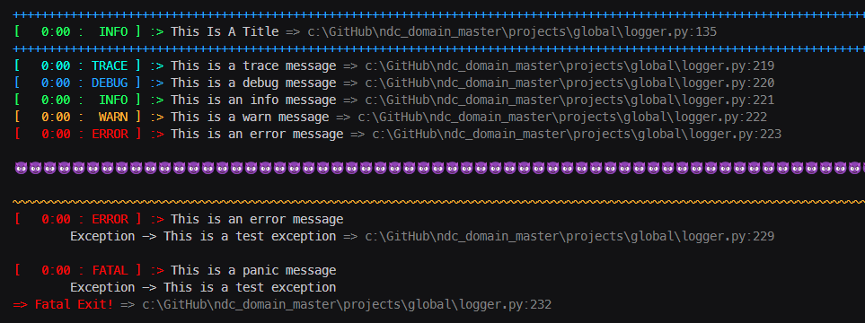

# My_Stupid_Utils

Just some random utils I use... Nothing crazy but feel free to 'em.


## Python:

- ### [Python Logger](./python/logger/logger.py)
  - Simple thread safe logger that runs using a queue to ensure order. Nothing to init, no fuss.
    ```python
    def test():
        title('This is a title')

        trace('This is a trace message')
        debug('This is a debug message')
        info('This is an info message')
        warn('This is a warn message')
        error('This is an error message')

        sep('😈', new_line_before=True, is_emoji=True)
        sep('~', 'yellow', new_line_before=True)

        # can directly pass exception - class to left of arrow msg to the right
        error('This is an error message', Exception('This is a test exception'))

        # kills program
        panic('This is a panic message', Exception('This is a test exception'))


    if __name__ == '__main__':
        test()
    ```
  - Console out
  - 

- ### [Auto Sphinx](./python/auto_sphinx/auto_sphinx.py)
  - Routine that will auto gen sphinx for docs.
  - Do note: it will auto install sphinx, pathspec, and sphinx-rtd-theme.
    - It uses pathspec to respect gitignore files
  - You will need to update the following to your project
  ```python
    # =============================================================================
    # [ Configuration ]
    # =============================================================================
    gitignore_path = '.gitignore'
    mapping_entry_point = 'path to where you want it to start mapping'
    project_name = 'name of project'
    author_name = 'your name'

    # any extra dirs you don't care about mapping for the sake of docs
    ignored_dirs = ['__pycache__', '.pytest_cache', '.git', '.vscode', '_tests']
    ```
  - This routine is designed for ease of use - it cleans itself everytime you run it. New files get added, deleted files get removed, renamed etc...
  - ***I would not use this once you have stabilized and want to add in custom notes and documentation that is not in the code base. this is for very simple stuff - usually local use libs or things not meant for public use.***
